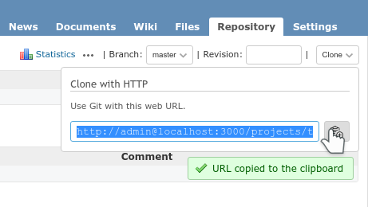

The *original developer* of the plugin is *voondo*. I just modified this plugin a little.

Redmine plugin - Git Server
============

This Redmine plugin lets your users pull and push to/from your git repositories hosted on Redmine with HTTP - without any complex setup.

Under the hood, it relies on [Grack](https://github.com/grackorg/grack), a Ruby/Rack Git Smart HTTP Server Handler.

Screenshot
------------

Installation
------------

This plugin is tested with Redmine 4.1+ (but it could be compatible with other versions).

Please apply general instructions for plugins [here](http://www.redmine.org/wiki/redmine/Plugins).

Note that this plugin depends on this other plugin:
* **redmine_base_deface** [here](https://github.com/jbbarth/redmine_base_deface)

First download the source or clone the plugin and put it in the "plugins/" directory of your redmine instance. Note that this is crucial that the directory is named 'redmine_git_server'!

Then execute:

    $ bundle install
    $ rake redmine:plugins

And finally restart your Redmine instance.

Permissions
-----------

* *Git Server > Enable git server* : allows a user to enable/disable the project module "Git Server"
* *(Redmine built-in) Repository > View changesets* : allows a user to fetch changesets (pull) from a repository
* *(Redmine built-in) Repository > Commit access* : allows a user to push to a repository

Alternatives
------------

* [redmine_git_hosting](http://redmine-git-hosting.io/) - based on Gitolite, this plugin offer a **lot** more features but it is also more complex to setup.

Known issues
------------

Puma 3.7 which is currently bundled with Redmine has an issue with chunked uploads. You can upgrade to Puma 4.3 or configure git locally to avoid chunked uploads (eg. `git config --global http.postBuffer 524288000`)
